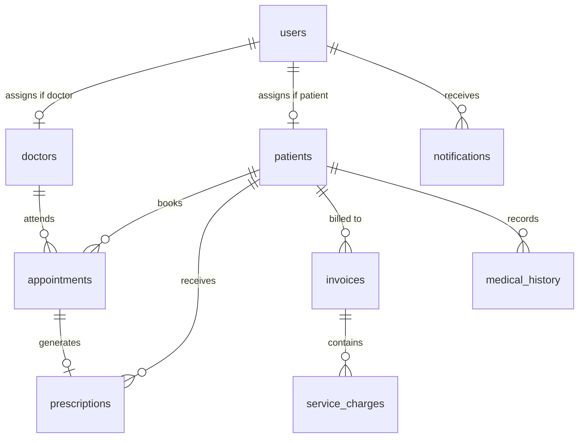

# MediSync AI - Backend Architecture Plan

This blueprint outlines the complete backend architecture for MediSync AI. This document serves as the implementation guide for the backend phase. Do not write backend code yet; focus on completing the frontend state and views.

---

## 1. Database Schema Design (PostgreSQL)



### Table Definitions

#### `users`
*   `id`: `UUID` (Primary Key, Default: `uuid_generate_v4()`)
*   `name`: `VARCHAR(100)` (Not Null)
*   `email`: `VARCHAR(150)` (Unique, Not Null)
*   `password_hash`: `VARCHAR(255)` (Not Null)
*   `role`: `VARCHAR(20)` (Not Null - `admin` | `doctor` | `receptionist` | `patient` | `pharmacy`)
*   `phone`: `VARCHAR(20)` (Nullable)
*   `created_at`: `TIMESTAMP` (Default: `CURRENT_TIMESTAMP`)

#### `departments`
*   `id`: `VARCHAR(10)` (Primary Key, e.g. `DEP01`)
*   `name`: `VARCHAR(100)` (Unique, Not Null)
*   `head_doctor_id`: `UUID` (Foreign Key -> `doctors.id`, Nullable)
*   `icon`: `VARCHAR(5)` (Nullable)
*   `color`: `VARCHAR(20)` (Nullable)

#### `doctors`
*   `id`: `UUID` (Primary Key, Foreign Key -> `users.id` on delete cascade)
*   `specialty`: `VARCHAR(100)` (Not Null)
*   `department_id`: `VARCHAR(10)` (Foreign Key -> `departments.id`)
*   `experience`: `VARCHAR(30)` (Not Null)
*   `consultation_fee`: `INTEGER` (Not Null)
*   `schedule`: `VARCHAR(100)` (Default: `Mon-Fri 9AM-5PM`)
*   `qualifications`: `VARCHAR(255)` (Not Null)
*   `status`: `VARCHAR(20)` (Default: `Available` - `Available` | `Busy` | `On Leave`)
*   `rating`: `DECIMAL(3,2)` (Default: `5.00`)
*   `digital_signature_url`: `VARCHAR(255)` (Nullable - URL/path to stored digital/drawn signature image)

#### `patients`
*   `id`: `UUID` (Primary Key, Foreign Key -> `users.id` on delete cascade)
*   `age`: `INTEGER` (Not Null)
*   `gender`: `VARCHAR(10)` (Not Null)
*   `blood_group`: `VARCHAR(5)` (Not Null)
*   `condition`: `VARCHAR(150)` (Nullable)
*   `address`: `TEXT` (Nullable)
*   `allergies`: `TEXT` (Default: `None`)
*   `insurance`: `VARCHAR(100)` (Nullable)
*   `status`: `VARCHAR(20)` (Default: `Active` - `Active` | `Inactive` | `Critical`)

#### `appointments`
*   `id`: `UUID` (Primary Key, Default: `uuid_generate_v4()`)
*   `patient_id`: `UUID` (Foreign Key -> `patients.id` on delete cascade)
*   `doctor_id`: `UUID` (Foreign Key -> `doctors.id` on delete cascade)
*   `date`: `DATE` (Not Null)
*   `time`: `TIME` (Not Null)
*   `type`: `VARCHAR(50)` (Default: `Consultation` - `Consultation` | `Follow-up` | `Emergency` | `Procedure` | `Lab Results`)
*   `status`: `VARCHAR(20)` (Default: `Scheduled` - `Scheduled` | `Waiting` | `In Progress` | `Confirmed` | `Cancelled`)
*   `priority`: `VARCHAR(20)` (Default: `Normal` - `Normal` | `High` | `Emergency`)
*   `notes`: `TEXT` (Nullable)
*   `fee`: `INTEGER` (Not Null)
*   `queue_number`: `INTEGER` (Nullable)
*   `created_at`: `TIMESTAMP` (Default: `CURRENT_TIMESTAMP`)

#### `prescriptions`
*   `id`: `UUID` (Primary Key, Default: `uuid_generate_v4()`)
*   `appointment_id`: `UUID` (Foreign Key -> `appointments.id` on delete set null)
*   `patient_id`: `UUID` (Foreign Key -> `patients.id` on delete cascade)
*   `doctor_id`: `UUID` (Foreign Key -> `doctors.id` on delete cascade)
*   `date`: `DATE` (Default: `CURRENT_DATE`)
*   `medications`: `JSONB` (Nullable - Array of `{ name, dosage, frequency, duration }` if digitally issued)
*   `notes`: `TEXT` (Nullable)
*   `scanned_image_url`: `VARCHAR(255)` (Nullable - URL to upload scanned prescription for handwritten scripts)
*   `digital_signature_base64`: `TEXT` (Nullable - Encoded drawn/digital signature authorizing the Rx)

#### `invoices`
*   `id`: `VARCHAR(30)` (Primary Key, e.g. `INV-2026-0001`)
*   `patient_id`: `UUID` (Foreign Key -> `patients.id` on delete cascade)
*   `date`: `DATE` (Default: `CURRENT_DATE`)
*   `due_date`: `DATE` (Not Null)
*   `amount`: `INTEGER` (Not Null)
*   `paid`: `INTEGER` (Default: 0)
*   `status`: `VARCHAR(20)` (Default: `Pending` - `Paid` | `Pending` | `Partial` | `Overdue`)
*   `scanned_image_url`: `VARCHAR(255)` (Nullable - URL to uploaded/scanned physical bill or receipt)

#### `service_charges`
*   `id`: `UUID` (Primary Key, Default: `uuid_generate_v4()`)
*   `invoice_id`: `VARCHAR(30)` (Foreign Key -> `invoices.id` on delete cascade)
*   `name`: `VARCHAR(150)` (Not Null)
*   `amount`: `INTEGER` (Not Null)

#### `medical_history`
*   `id`: `UUID` (Primary Key, Default: `uuid_generate_v4()`)
*   `patient_id`: `UUID` (Foreign Key -> `patients.id` on delete cascade)
*   `condition`: `VARCHAR(150)` (Not Null)
*   `diagnosed_date`: `DATE` (Not Null)
*   `severity`: `VARCHAR(20)` (Not Null - `Mild` | `Moderate` | `Severe`)
*   `doctor_id`: `UUID` (Foreign Key -> `doctors.id` on delete set null)

#### `notifications`
*   `id`: `UUID` (Primary Key, Default: `uuid_generate_v4()`)
*   `user_id`: `UUID` (Foreign Key -> `users.id` on delete cascade)
*   `type`: `VARCHAR(30)` (Not Null - `appointment` | `emergency` | `payment` | `system` | `cancel`)
*   `message`: `TEXT` (Not Null)
*   `read`: `BOOLEAN` (Default: `FALSE`)
*   `created_at`: `TIMESTAMP` (Default: `CURRENT_TIMESTAMP`)

---

## 2. API Endpoints (Express.js REST API)

### Authentication `/api/auth`
*   `POST /register`: Register a new user (hash password with bcrypt, assign default patient profile if role = patient).
*   `POST /login`: Verify credentials, generate and return JWT.
*   `GET /me`: Return current user object based on JWT token in authorization header.

### Patients `/api/patients`
*   `GET /`: Retrieve all patients (with search and status queries). *Admin, Doctor, Receptionist access*
*   `GET /:id`: Retrieve individual patient, including full history, appointments, and bills. *All roles (Patients can only see their own)*
*   `POST /`: Create a new patient profile (and matching user account). *Admin, Receptionist access*
*   `PUT /:id`: Update patient details. *Admin, Receptionist, Patient (own) access*
*   `DELETE /:id`: Delete patient and associated data. *Admin access*

### Doctors `/api/doctors`
*   `GET /`: Retrieve all doctors.
*   `POST /`: Add a new doctor (and matching user account). *Admin access*
*   `PUT /:id`: Update doctor details. *Admin, Doctor (own) access*
*   `DELETE /:id`: Remove doctor. *Admin access*

### Appointments `/api/appointments`
*   `GET /`: List all appointments (filter by date, doctor, patient). *Admin, Doctor, Receptionist access*
*   `GET /my-appointments`: Retrieve appointments for the logged-in doctor or patient.
*   `POST /`: Book an appointment (auto-assigns queue number, creates WhatsApp notification trigger). *Admin, Receptionist, Patient access*
*   `PUT /:id/status`: Update appointment status (Waiting, In Progress, Confirmed, Cancelled). *Admin, Doctor, Receptionist access*
*   `PUT /:id/reschedule`: Update appointment date/time.

### Billing `/api/billing`
*   `GET /invoices`: List all invoices. *Admin, Patient (own) access*
*   `POST /invoices`: Generate a new invoice (accepts array of service charges). *Admin access*
*   `POST /invoices/:id/pay`: Process payment (simulate gateway, update paid status).
*   `GET /invoices/:id/pdf`: Generate invoice PDF download stream.
*   `POST /invoices/:id/upload-receipt`: Upload scanned invoice copy or receipt image. *Patient, Admin access*

### Prescriptions `/api/prescriptions`
*   `GET /`: Retrieve prescriptions (filtered by patient or doctor).
*   `POST /`: Issue a new prescription (structured json). *Doctor access*
*   `POST /upload-scan`: Upload physical handwritten prescription scan. *Doctor, Receptionist access*
*   `POST /:id/sign`: Authorize a prescription with a digital signature (drawn image/base64 key). *Doctor access*

### Pharmacy `/api/pharmacy`
*   `GET /prescriptions`: Retrieve and search all approved patient prescriptions (read-only view). *Pharmacy role access*
*   `GET /prescriptions/:id`: View a specific prescription with its signature details. *Pharmacy role access*

### AI Features `/api/ai`
*   `POST /chat`: Interact with Gemini AI for symptom analysis.
*   `POST /summarize`: Receive file upload (prescription/report) and query Gemini to summarize.

---

## 3. Server Architecture & Middleware

*   **Technology**: Node.js + Express.js + TypeScript
*   **Authentication Middleware**: Standard bearer JWT verification.
    ```typescript
    const authenticateJWT = (req: Request, res: Response, next: NextFunction) => {
      const authHeader = req.headers.authorization;
      if (!authHeader) return res.sendStatus(401);
      const token = authHeader.split(' ')[1];
      jwt.verify(token, JWT_SECRET, (err, user) => {
        if (err) return res.sendStatus(403);
        req.user = user;
        next();
      });
    };
    ```
*   **Role Authorization Guard**:
    ```typescript
    const requireRole = (allowedRoles: string[]) => {
      return (req: Request, res: Response, next: NextFunction) => {
        if (!req.user || !allowedRoles.includes(req.user.role)) {
          return res.status(403).json({ error: 'Access denied: insufficient permissions' });
        }
        next();
      };
    };
    ```
*   **Error Handler**: Centered try-catch handler returning normalized JSON errors.
*   **Security & Optimization**:
    *   `cors` configuration for specific frontend origin.
    *   `helmet` headers for basic security.
    *   `express-rate-limit` to prevent brute force.

---

## 4. AI & Third-Party Services Integration Plan

### Gemini AI Integration
*   Use `@google/generative-ai` SDK.
*   Setup a system instruction set defining the AI as a clinical assistant:
    ```
    You are MediSync AI, an intelligent clinical assistant for a Hospital Management System. 
    You do NOT give final medical diagnoses. You provide helpful information, suggest possible symptoms to check with doctors, and summarize clinical documents concisely.
    ```

### Cloud File Storage (Future Upgrade)
*   **Cloudinary** or **AWS S3** pre-signed URLs for document uploads.
*   Frontend requests pre-signed URL, uploads file directly to storage, and posts file URL to backend.

### SMS & WhatsApp Reminders (Future Upgrade)
*   **Twilio API / WhatsApp Business API**: Triggered on `appointments` insert.
*   Pushes webhook payloads to Twilio containing patient name, doctor, date, and time.
